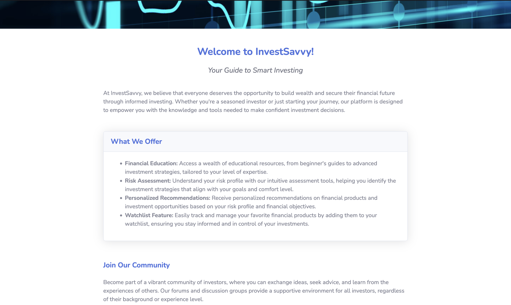
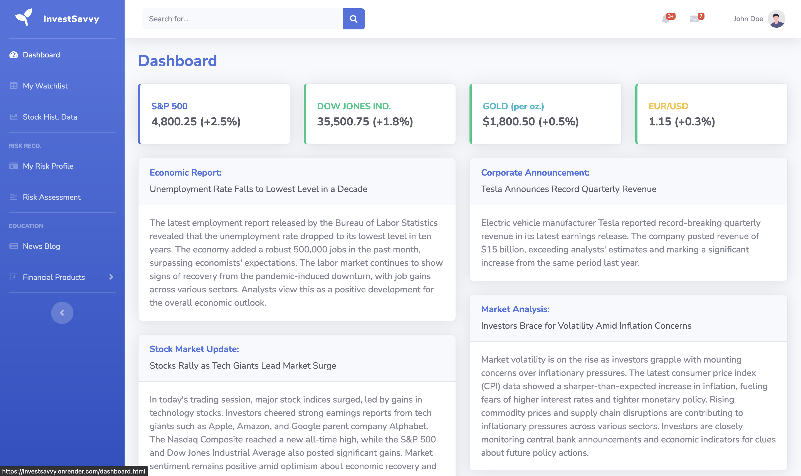
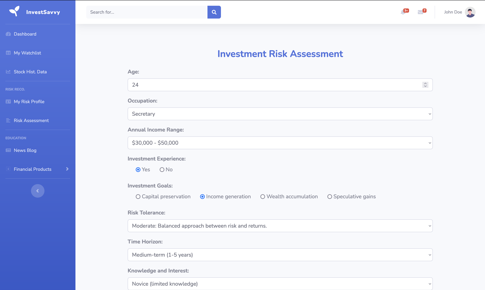
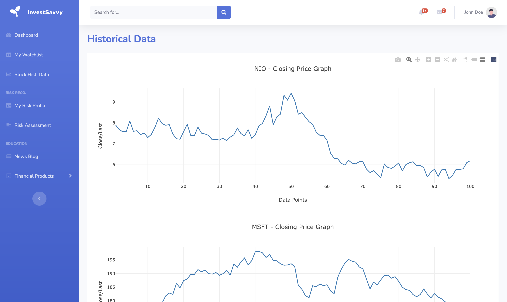
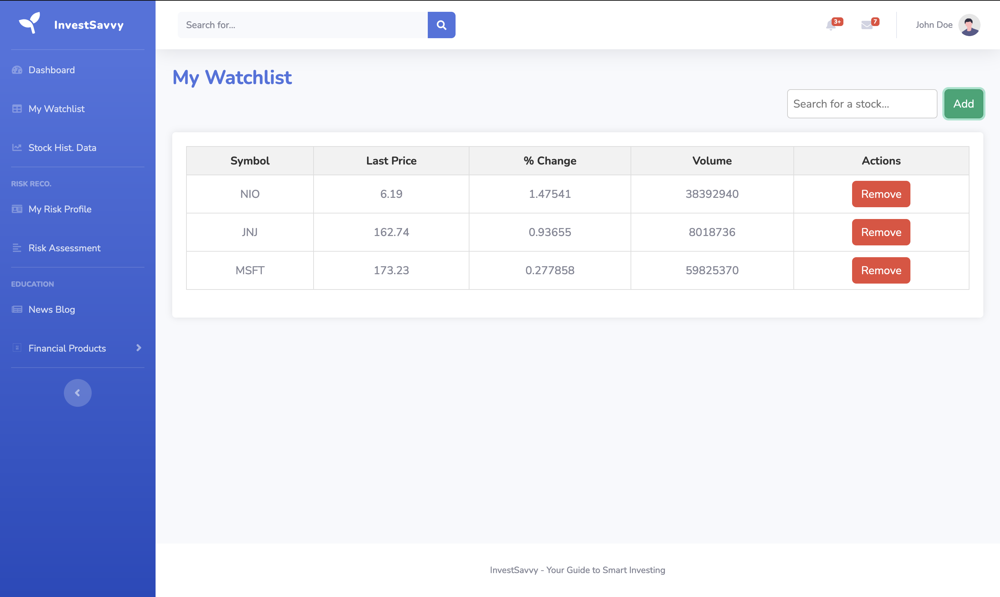

# InvestSavvy

<!-- TOC start -->
- [Project Description](#project-description)
  - [Project Website](#project-website)
  - [External Applications Used](#external-applications-used)
- [API Specifications](#api-specifications)
- [Frontend Website](#frontend-website)
- [Backend Server](#backend-server)
- [Database](#database)
  - [Database Structure](#database-structure)
- [Features Implemented](#features-implemented)
  - [Features To-Do](#features-to-do)
- [CI/CD WorkFlow](#cicd-workflow)
  - [Docker Containerization](#docker-containerization)
  - [API Unit Testing](#api-unit-testing)
  - [Deploying Backend to Production](#deploying-backend-to-production)
- [Directory Structure](#directory-structure)
- [Documentation To-Do](#documentation-to-do)
<!-- TOC end -->

## Project Description

A sample financial website that provides users with insights into their financial risk profiles and suggeste suitable financial products for investment, allowing them to manage their watchlists 

### Project Website

Demo the project website at https://investsavvy.onrender.com/

### External Applications Used

Frontend website and Backend server deployed using [Render](https://render.com/)  
Database hosted at [Aiven for MySQL](https://aiven.io/docs/products/mysql/overview)

## API Specifications
## Frontend Website
**Landing Page** -  Main site to highlight the purpose and functionality of the website  

**Account Login/registration** - To be integrated with Auth0  

**User Dashboard** for user to have an overview of their account    

**Risk Assessment** - Risk profile assessment to understand user’s investment background  

**Historical Stock** - A chart to showcase the past performance of stocks  

**Watchlist** - Page where user can create their own watchlist selection  

## Backend Server

## Database

### Database Structure

Users

## Features Implemented

### Features To-Do
- External Financial API
- Auth0

## CI/CD WorkFlow

Insert pipeline image and explanation - GitHub Actions

### Docker Containerization

Build Docker container  
Do Sanity Test  
Pushish to GitHub Container Registry - insert link

### API Unit Testing

Pull Docker Image from GHCR and run  
Postman Collection and Test Environment  
Postman Commandline Integration (CLI)  

### Deploying Backend to Production

Deploy using Render WebHook

## Directory Structure

- **/public/frontend**: Contains the source code for the website
- **/backend**: Contains the source code for the backend server

## Documentation To-Do
- Database Structure
- API Specification