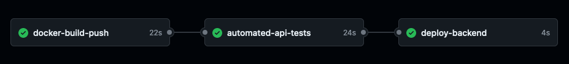

# InvestSavvy

- [Project Description](#project-description)
  - [Project Website](#project-website)
  - [External Applications Used](#external-applications-used)
- [Frontend Website](#frontend-website)
- [API Specifications](#api-specifications)
- [Backend Server](#backend-server)
  - [Database](#database)
- [\[To-Do\] Features List](#to-do-features-list)
- [CI/CD WorkFlow](#cicd-workflow)
- [Directory Structure](#directory-structure)

## Project Description

A sample financial website that provides users with insights into their financial risk profiles and suggeste suitable financial products for investment, allowing them to manage their watchlists 

### Project Website

Demo the project website at https://investsavvy.onrender.com/. 
Login authentication has been disabled, type out any username/password to access.

### External Applications Used

Frontend website and Backend server deployed using [Render](https://render.com/)  
Database hosted at [Aiven for MySQL](https://aiven.io/docs/products/mysql/overview)

## Frontend Website
- **Landing Page** -  Main site to highlight the purpose and functionality of the website  
- **Account Login/registration** - To be integrated with Auth0
- **User Dashboard** - for users to have an overview of their account
- **Risk Assessment** - Risk profile assessment to understand user’s investment background  
- **Historical Stock Data** - A chart to showcase the past performance of stocks  
- **Watchlist** - Page where user can create their own watchlist selection  

More details in [FrontEnd Documentation](docs/frontend.md).

## API Specifications

More details in [API Documentation](docs/api.md).

## Backend Server

**Node.js** is used to create a web server listening for HTTP requests as per the defined API specification. It is connected to an externally hosted SQL database.

### Database

[Aiven for MySQL](https://aiven.io/docs/products/mysql/overview) is used to host the database. Database structure and more details in [Database Documentation](docs/database.md).

## [To-Do] Features List
- External Financial API
- Auth0 integration
- Subcription plan and payment method like Stripe

## CI/CD WorkFlow

GitHub Actions is used to trigger an automated workflow for the backend, this involves:
- containerizing the backend server into a docker image
- testing its API functionalities through automated unit testing, and 
- deploying the server if everything works. 

More details in [CI/CD Documentation](docs/ci-cd.md).

## Directory Structure

- `/public/frontend`: Contains the source code for the website
- `/backend`: Contains the source code for the backend server
- `/docs`: All additional documentation
