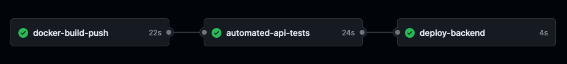

# CI/CD Workflow
[](https://github.com/varunshaji98/investsavvy/actions/workflows/CI-CD-pipeline.yml)

- [Objective](#objective)
- [JOB 1: docker-build-push](#job-1-docker-build-push)
  - [STEP 1: Containerize into Docker image](#step-1-containerize-into-docker-image)
  - [STEP 2: Sanity Test](#step-2-sanity-test)
  - [STEP 3: Push to GitHub Container Registry](#step-3-push-to-github-container-registry)
- [JOB 2: automated-api-tests](#job-2-automated-api-tests)
  - [Postman Command Line Integration (CLI)](#postman-command-line-integration-cli)
    - [InvestSavvy Postman Collection and Test Environment](#investsavvy-postman-collection-and-test-environment)
  - [STEP 1: Pull docker image from GitHub Container Registry](#step-1-pull-docker-image-from-github-container-registry)
  - [STEP 2: Run the container](#step-2-run-the-container)
  - [STEP 3: Install and Run Postman CLI tests](#step-3-install-and-run-postman-cli-tests)
- [JOB 3: deploy-backend](#job-3-deploy-backend)


## Objective

Implement a CI/CD Workflow through GitHub Actions that involves: 
- containerizing the backend server into a docker image
- testing its API functionalities through automated unit testing, and 
- deploying the server if everything works. 



This workflow is limited to push/pull requests into backend folder of main branch
```yml
on:
  push:
    branches: [ "main" ]
    paths:
      - backend/**
  pull_request:
    branches: [ "main" ]
    paths:
      - backend/**
```

## JOB 1: docker-build-push

### STEP 1: Containerize into Docker image

The backend server is containerised into Docker images for server deployment into test environment and eventually for production. This step uses the [Dockerfile](../backend/Dockerfile) defined to build the image.

```yml
docker-build-push:
    runs-on: ubuntu-latest
    steps:
    - name: Checkout 
      uses: actions/checkout@v3
    - name: Build the Docker image
      run: |
        docker build . --file backend/Dockerfile \
          --tag ghcr.io/varunshaji98/investsavvy:$(date +%s) \
          --tag ghcr.io/varunshaji98/investsavvy:latest
```

### STEP 2: Sanity Test
A quick test is done to check if the docker container can start without errors.
-  `-p 3000:3000` exposes container's port 3000 to the host machine's port 3000
-  `-e` (or `--env`) arguments passed here are the environment variables needed to run the containerised server
-  `-d` starts a detached container

```yml
    - name: Do a quick sanity test on the docker image
      run: |
        docker run -p 3000:3000 \
          -e DB_HOST=${{ secrets.DB_HOST }} \
          -e DB_PORT=${{ secrets.DB_PORT }} \
          -e DB_USER=${{ secrets.DB_USER }} \
          -e DB_PASS=${{ secrets.DB_PASS }} \
          -e DB_NAME=${{ secrets.DB_NAME }} \
          -d ghcr.io/varunshaji98/investsavvy:latest
```

### STEP 3: Push to GitHub Container Registry

[GitHub Container Registry](https://docs.github.com/en/packages/working-with-a-github-packages-registry/working-with-the-container-registry) is used to store the built images. These are private packages accessible to the repo collaborators, hence a `GITHUB_TOKEN` is needed to authenticate and login to the registry. This is stored as a secret variable.  

```yml
    - name: Login to GitHub Container Registry
      uses: docker/login-action@v3
      with:
        registry: ghcr.io
        username: ${{ github.repository_owner }}
        password: ${{ secrets.PROJECT_GITHUB_TOKEN }}
    - name: Push to Github Container Registry
      run: |
        docker push -a ghcr.io/varunshaji98/investsavvy
```
Once pushed into registry, the packages are available at [ghcr.io/varunshaji98/investsavvy](ghcr.io/varunshaji98/investsavvy). Images are tagged with both `current_timestamp` and `latest`; the latest tagged image changes with each successful commit job. 

>**Note**: GitHub Container Registry only provides 500MB free, and the registry needs to be cleaned regularly. Data transfers are unlimited if its through GitHub Actions, otherwise data out is limited to 2GB per month.


## JOB 2: automated-api-tests

Automated API unit tests are performed on the newly dockerized backend server using Postman CLI. 

### Postman Command Line Integration (CLI) 

The [Postman CLI](https://learning.postman.com/docs/postman-cli/postman-cli-overview/) is a secure command-line companion for Postman. It enables you to:
- Run a collection with its collection ID or path.
- Send run results to Postman by default.
- Supports sign in and sign out.

#### InvestSavvy Postman Collection and Test Environment

The API specification and collection was created in Postman during development, these are reused for testing. Test cases can be defined for each API call and different variables can be passed to the call based on which environment is selected. 

The Test Environment with sample configurable variables is shown below


A Sample test series defined for one API `POST` call is given below. These are available within the Postman Collection. 
```js
// Test 1/5
pm.test("Response status code is 200", function () {
  pm.response.to.have.status(200);
});

// Test 2/5
pm.test("Symbol is a non-empty string", function () {
    const responseData = pm.response.json();
    
    responseData.forEach(function(item) {
        pm.expect(item.symbol).to.be.a('string').and.to.have.lengthOf.at.least(1, "Symbol should be a non-empty string");
    });
});

// Test 3/5
pm.test("Name is a non-empty string", function () {
  const responseData = pm.response.json();

  responseData.forEach(function(item) {
    pm.expect(item.name).to.be.a('string').and.to.have.lengthOf.at.least(1, "Name should not be empty");
  });
});

// Test 4/5
pm.test("Risk_profile_id is a positive integer", function () {
  const responseData = pm.response.json();

  responseData.forEach(function(item) {
    pm.expect(item.risk_profile_id).to.be.a('number').above(0);
  });
});

// Test 5/5
pm.test("Each item's risk_profile_id corresponds to the one sent in the request query", function () {
    const riskProfileId = pm.request.url.query.toObject().rpid;
    const responseData = pm.response.json();

    responseData.forEach(function(item) {
        pm.expect(item.risk_profile_id.toString()).to.equal(riskProfileId);
    });
});
```
More details on API test cases in [API Documentation](api.md)

### STEP 1: Pull docker image from GitHub Container Registry

```yml
automated-api-tests:
    needs: docker-build-push
    runs-on: ubuntu-latest
    steps:
    - name: Checkout
      uses: actions/checkout@v3
    - name: Login to GitHub Container Registry
      uses: docker/login-action@v3
      with:
        registry: ghcr.io
        username: ${{ github.repository_owner }}
        password: ${{ secrets.PROJECT_GITHUB_TOKEN }}
    - name: Pull latest image from Github Container Registry
      run: docker pull ghcr.io/varunshaji98/investsavvy
```
### STEP 2: Run the container
```yml
    - name: Run the docker container
      run: |
        docker run -p 3000:3000 \
          -e DB_HOST=${{ secrets.DB_HOST }} \
          -e DB_PORT=${{ secrets.DB_PORT }} \
          -e DB_USER=${{ secrets.DB_USER }} \
          -e DB_PASS=${{ secrets.DB_PASS }} \
          -e DB_NAME=${{ secrets.DB_NAME }} \
          -d ghcr.io/varunshaji98/investsavvy
        sleep 5
```

### STEP 3: Install and Run Postman CLI tests

Postman CLI is installed in the host machine and logged into using `POSTMAN_API_KEY` saved as secret. The tests are run by passing the `collection_id` and `environment_id`

```yml
    - name: Install Postman CLI
      run: |
        curl -o- "https://dl-cli.pstmn.io/install/linux64.sh" | sh
    - name: Login to Postman CLI
      run: postman login --with-api-key ${{ secrets.POSTMAN_API_KEY }}
    - name: Run API tests
      run: |
        docker ps
        postman collection run "33397024-6c70459c-802f-464e-8160-f7053090d68a" \
          -e "33397024-1dbd4062-670f-4bde-b475-04a9a4eb831e"
```

Test Results for one of the passed jobs in shown below. 


## JOB 3: deploy-backend

[Render Deploy Hooks](https://docs.render.com/deploy-hooks) are used to manually deploy the backend server on a hosting site - Render. `RENDER_DEPLOY_HOOK_URL` is stored as a secret.

```yml
deploy-backend:
    needs: [docker-build-push, automated-api-tests]
    runs-on: ubuntu-latest
    steps:
    - name: Deploy
      env:
        deploy_url: ${{ secrets.RENDER_DEPLOY_HOOK_URL }}
      run: |
        curl "$deploy_url"
```
The server is then successfully deployed on the hosting site.


 