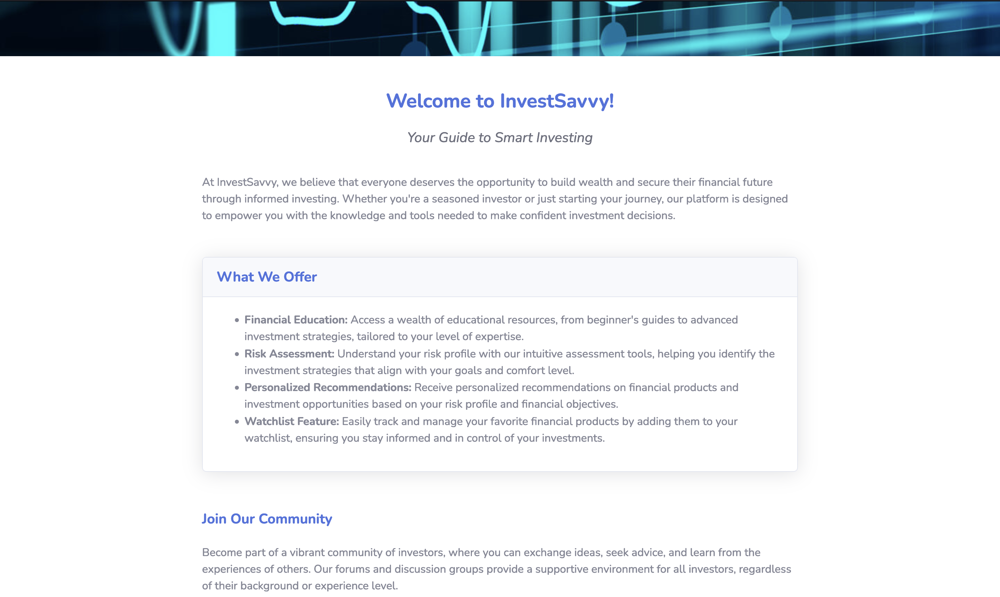
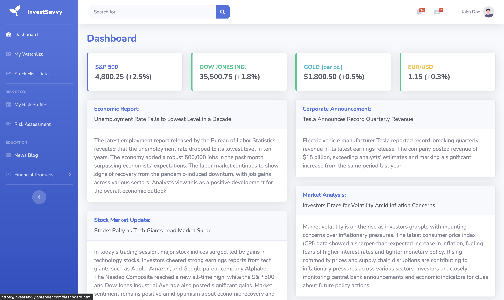
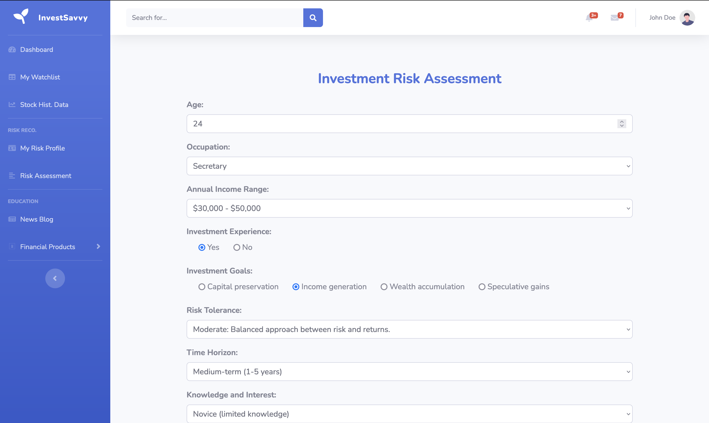
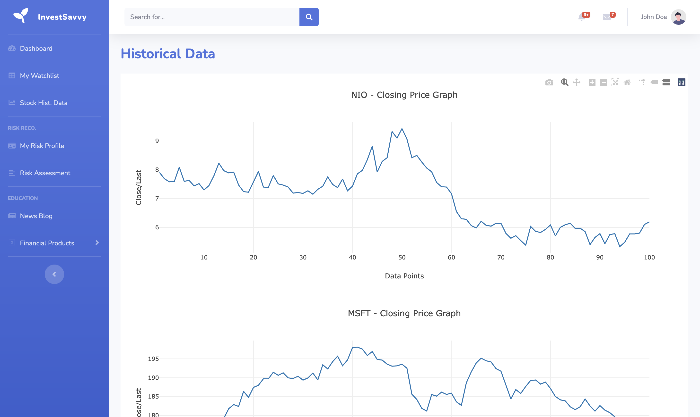
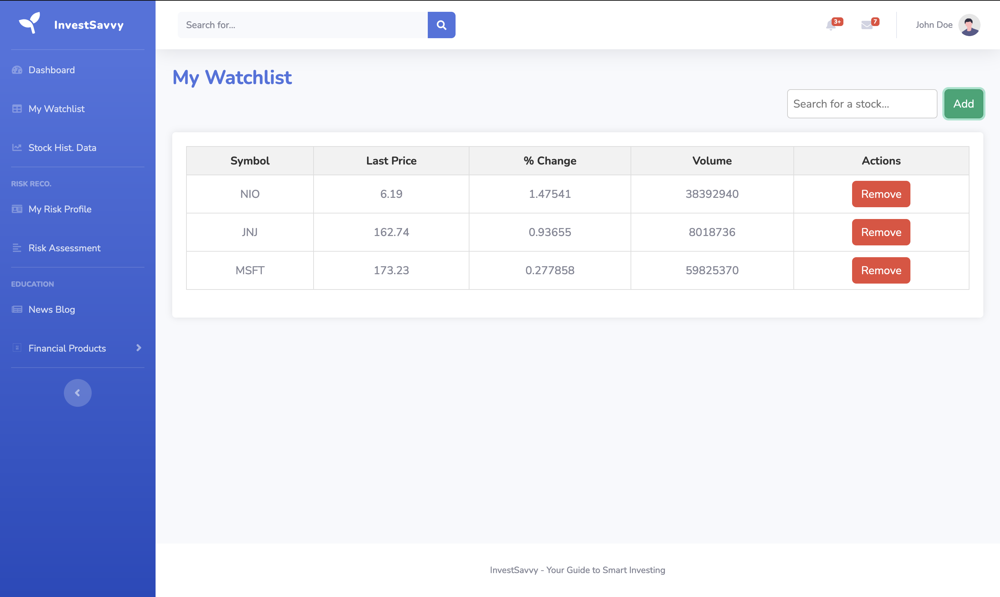

# Frontend Website 

**Landing Page** -  Main site to highlight the purpose and functionality of the website  


**Account Login/registration** - To be integrated with Auth0  

**User Dashboard** for user to have an overview of their account    


**Risk Assessment** - Risk profile assessment to understand user’s investment background  


**Historical Stock** - A chart to showcase the past performance of stocks  


**Watchlist** - Page where user can create their own watchlist selection  


## Integrating with Backend Server

### Javascript fetch
```js
const myHeaders = new Headers();
myHeaders.append("Content-Type", "application/json");

const raw = JSON.stringify({
  "first_name": "<string>",
  "last_name": "<string>",
  "email": "<string>",
  "password_hash": "<string>",
  "user_type": "<string>"
});

const requestOptions = {
  method: "POST",
  headers: myHeaders,
  body: raw,
  redirect: "follow"
};

fetch("localhost:3000/user/register", requestOptions)
  .then((response) => response.text())
  .then((result) => console.log(result))
  .catch((error) => console.error(error));
```